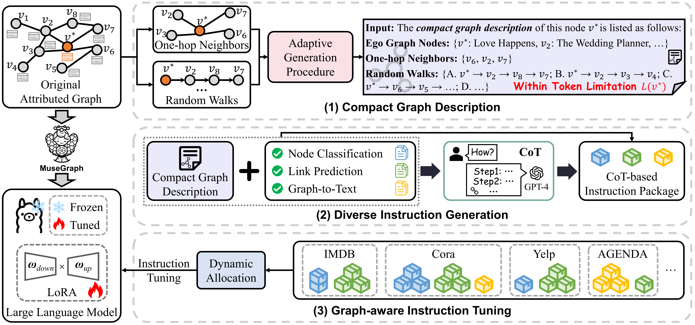

# MuseGraph

The official implementation of Graph-oriented Instruction Tuning of Large Language Models for Generic Graph Mining (TPAMI 2025).



## Environment Setup

---
1. Llama-factory v0.8.0
2. Python 3.7.15

## Quick Start

---

**Train**&&**Test**&&**Evaulate**

```python
python src/lora_process.py
```


## Data Download

---
The datasets used in this project can be accessed from the following links:

- [IMDB](https://github.com/Ffffffffire/HINormer)  
- [Freebase](https://github.com/THUDM/HGB)  
- [Cora](https://github.com/agiresearch/InstructGLM)  
- [Arxiv](https://ogb.stanford.edu/docs/leader_nodeprop/#ogbn-arxiv)

- [Yelp](https://github.com/yangji9181/HNE)  
- [MIMIC-III](https://physionet.org/content/mimiciii/1.4/)  

- [AGENDA](https://github.com/rikdz/GraphWriter)  
- [WebNLG](https://webnlg-challenge.loria.fr/challenge_2017/)  

- [Dyval](https://github.com/microsoft/promptbench)  

## Prompt Template

---

### IMDB 

| Type                  | Prompt |
|-----------------------|--------|
| **Task-specific Instruction** | **Input:** Given the target MOVIE with the compact graph description in the IMDB dataset, what the following categories does this MOVIE belong to: {Category List}. This MOVIE may have one or more categories. Directly give the answer of this MOVIE's categories.<br><br>The compact graph description of this MOVIE is listed as follows: Title: {Title of MOVIE} Ego Graph Nodes: {Ego Graph Node List} One-hop Neighbors: {1-hop Neighbor List} Random Walks: {Random Walk Paths}.<br><br>**Output:** {Ground-truth Category List}.  |
| **Querying GPT-4**    | I have a question as below: {Task-specific Instruction Input} and the answer is {Task-specific Instruction Output}. Imagine that you have made the correct choice and proceed with step-by-step reasoning. Your reasoning needs to incorporate Ego Graph Nodes, One-hop Neighbors, and Random Walks in the given compact graph description. |
| **CoT-based Instruction** | **Input:** Given the target MOVIE with the compact graph description in the IMDB dataset, what the following categories does this MOVIE belong to: {Category List}. This MOVIE may have one or more categories. Please think about the categorization in a step-by-step manner and avoid making false associations. Then provide your reasoning. Using the following format: Answer: {Answer}; Reasoning: {Reason}.<br><br>The compact graph description of this MOVIE is listed as follows: Title: {Title of MOVIE} Ego Graph Nodes: {Ego Graph Node List} One-hop Neighbors: {1-hop Neighbor List} Random Walks: {Random Walk Paths}.<br><br>**Output:** Answer: {Ground-truth Category List}; Reasoning: {Generated by GPT-4}. |


## Acknowledgements

We sincerely thank the following open-source repositories for their valuable codebases and contributions, which greatly helped this project:

- [LLaMA-Factory](https://github.com/hiyouga/LLaMA-Factory)
- [CogDL](https://github.com/THUDM/CogDL)
- [HGB](https://github.com/THUDM/HGB)
- [HNE](https://github.com/yangji9181/HNE)
- [promptbench](https://github.com/microsoft/promptbench)
- [InstructGLM](https://github.com/agiresearch/InstructGLM)
- [HINormer](https://github.com/Ffffffffire/HINormer)

